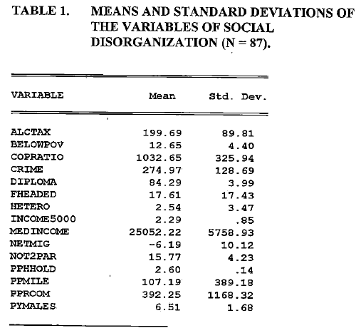
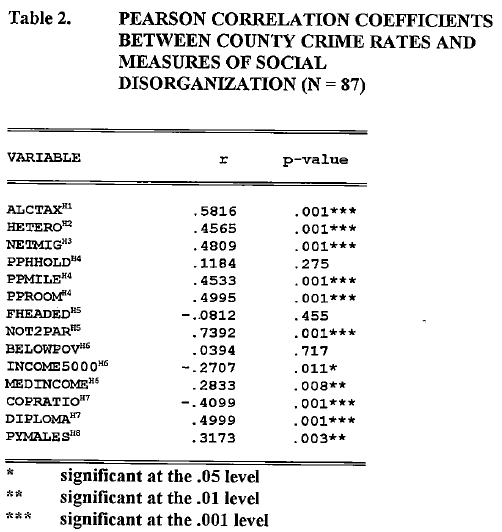
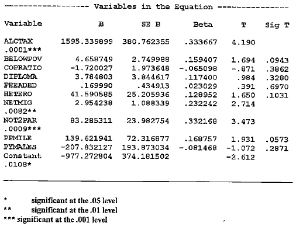

```{r Package_Data_Imports}
#| include: false

 library(tidyverse)
 library(tidycensus)

 library(fpp3)
 library(sf)

 library(patchwork)
 library(knitr)
 library(kableExtra)
 library(broom)
 library(Metrics)
 library(lmtest)
 library(sandwich)
 library(lme4)

 acs_5_yearly_data <- readRDS("data/acs_5_yearly_data.rds")
 acs_1_yearly_data <- readRDS("data/acs_1_yearly_data.rds")
 mapping_yearly_data <- readRDS("data/mapping_yearly_data.rds")
 crime_data <- readRDS("data/crime_data_merged.rds")
```

# Introduction

------------------------------------------------------------------------

## Basis of the Project

-   In 1998 J. Mark Norman and Donald E. Arwood published a paper titled “A Social Disorganization Theory of County Crime Rates in Minnesota”.
-   This paper looked to establish how a variety sociological measures of a society's organization and control affect the crime rates in a community, specifically across counties in Minnesota.

## Goals for the Project

-   Since 1998 there have been many changes in crime and it's determinants, particularly during the COVID-19 pandemic.
-   I hope to expand on this study using similar variables across the same region and answer the question: **Across Minnesotan counties how have the relationships between crime and its determinants changed over time, particularly in response to the COVID-19 pandemic?**

<!-- Do I really need a lit review section? -->

# Procedure

------------------------------------------------------------------------

**In order to answer this question I will follow the steps of:**<br>

1.  Collecting Data on Crime Rates in Minnesotan counties.<br>
2.  Collecting similar or the same data used in the original Norman and Arwood (1998) paper on the explanatory variables used for crime rates.<br>
3.  Analyzing how the relationships between crime and its determinants have changed since the original 1998 paper as well as before and after the COVID-19 pandemic.

## Step 1

::: center

:::

## Step 2

```{r Example_Tidycensus_Imports}
#| eval: false
#| echo: true
# Pulls 5 year ACS estimates for all variables at county level for MN
years = c(2018, 2023) # Want to compare pre-COVID years 2014-18 vs 2019-23 
acs_5yr_ts <- map_df(years, function(y) {
  get_acs(
    geography = "county",
    survey = "acs5",
    variables = vars, # predefined list of census variables to download
    state = "MN",
    year = y,
    geometry = TRUE
  ) |>
    select(GEOID, variable, estimate) |>
    mutate(
      GEOID = as.character(GEOID),
      year = y
    ) |>
    pivot_wider(names_from = variable, values_from = estimate)
})
```

# Step 3: Analysis

# Time Series Plots

## Homicides Over Time

```{r Homicides_Over_Time}

# Monthly totals
monthly_ts <- crime_data |>
  group_by(month) |>
  summarise(homicides = sum(homicides), .groups = "drop") |>
  mutate(type = "Monthly")  # Add type for plotting

# Yearly totals
yearly_ts <- crime_data |>
  group_by(year, county) |>
  summarise(
    population = first(total_population_acs1),  # take one value per county
    homicides = sum(homicides, na.rm = TRUE),
    .groups = "drop"
  ) |>
  group_by(year) |>
  summarise(
    population = sum(population, na.rm = TRUE),  # now only sum once per county
    homicides = sum(homicides, na.rm = TRUE),
    .groups = "drop"
  ) |>
  mutate(
    month = as.Date(paste0(year, "-01-01")),
    type = "Yearly"
  ) |>
  select(month, homicides, population, type)

# plotting df
combined_ts <- bind_rows(monthly_ts, yearly_ts)


# show the reasons for using yearly data due to how monthly is reported
ggplot(combined_ts, aes(x = month, y = homicides, color = type)) +
  geom_line(size = 1) +
  geom_point(data = subset(combined_ts, type == "Yearly"), size = 2) +  # emphasize yearly points
  scale_color_manual(values = c("Monthly" = "steelblue", "Yearly" = "darkblue")) +
  theme_minimal() +
  labs(title = "Minnesota Homicides Over Time", x = "Date", y = "Homicides", color = "Time Period")+
theme(
  legend.position = c(0.1, 0.8),   # normalized coordinates
  legend.background = element_rect(fill = alpha("white", 0.6)), # optional transparent box
  legend.title = element_text("Time Period")
)


# refactor yearly_ts data to only contain acs1 counties to compare homicide rates to population counts
yearly_ts <- acs_1_yearly_data|>
  group_by(year)|>
  summarise(population = sum(total_population_acs1),
            homicides_pc = sum(homicides)/sum(total_population_acs1),
            across(c(arson, assaults, burglary, gta, homicides, larceny, rape, robbery), sum))|>
  mutate(crime_rate = (arson+assaults+burglary+gta+homicides+larceny+rape+robbery)/population)
```

## Homicides Versus Population

```{r Homicides_Versus_Population}
# show homicides vs population relationship
# Compute a scaling factor to map population into homicide scale
scale_factor <- max(yearly_ts$crime_rate, na.rm = TRUE) / max(yearly_ts$population, na.rm = TRUE)

ggplot(yearly_ts, aes(x = year)) +
  # Population line (left axis, true scale)
  geom_line(aes(y = population, color = "Population"), size = 1, linetype = "dashed") +
  geom_point(aes(y = population, color = "Population"), size = 2) +
  
  # Homicides line (right axis, scaled down)
  geom_line(aes(y = crime_rate / scale_factor, color = "General Crime Rate"), size = 1) +
  geom_point(aes(y = crime_rate / scale_factor, color = "General Crime Rate"), size = 2) +
  
  scale_y_continuous(
    name = "Population",
    sec.axis = sec_axis(~ . * scale_factor, name = "General Crime Rate")
  ) +
  scale_color_manual(
    values = c("Population" = "firebrick", "General Crime Rate" = "purple")
  ) +
  theme_minimal() +
  labs(
    title = "Minnesota Population vs Crime Rates Over Time for ACS1 Counties",
    x = "Year",
    color = "",
    caption = "Source: ACS1 estimates; using Decennial counts for 2020"
  )+
theme(
  legend.position = c(0.2, 0.2),   # normalized coordinates
  legend.background = element_rect(fill = alpha("white", 0.6)), # optional transparent box
  legend.title = element_blank()
)
```

## Crime Rates and Populations

```{r crime_and_pop_mapping}
#| warning: False
  
# Base map for year 2023
data_2023 <- mapping_yearly_data |> 
  filter(year == 2023)

# Compute centroids only for the top cities
city_centroids <- data_2023 |>
  filter(top_cities == 1) |>
  st_centroid()

# Plot A — population
a <- ggplot(data_2023) +
  geom_sf(aes(fill = total_population_acs5), color = "white") +
  # black border for reservations
  geom_sf(
    data = subset(data_2023, reservations == 1),
    fill = NA,
    color = "black",
    size = .75
  ) +
  # Black dot at centroid for top cities
  geom_sf(
    data = city_centroids,
    color = "black", size = 1.8
  ) +
  scale_fill_viridis_c(
    option = "plasma",
    trans = "log10",
    name = "Total Population",
    labels = scales::label_number(scale_cut = scales::cut_short_scale())
  ) +
  theme_minimal() +
  theme(
    axis.text = element_blank(),
    axis.ticks = element_blank(),
    legend.position = "bottom",
    plot.margin = margin(0, 0, 0, 0)
  )

# Plot B — crime rate
b <- ggplot(data_2023) +
  geom_sf(aes(fill = crime_rate), color = "white") +
  geom_sf(
    data = subset(data_2023, reservations == 1),
    fill = NA,
    color = "black",
    size = .75
  ) +
  # Black dot at centroid for top cities
  geom_sf(
    data = city_centroids,
    color = "black", size = 1.8
  ) +
  scale_fill_viridis_c(
    option = "plasma",
    name = "Crime Rates"
  ) +
  theme_minimal() +
  theme(
    axis.text = element_blank(),
    axis.ticks = element_blank(),
    legend.position = "bottom",
    plot.margin = margin(0, 0, 0, 0)
  )

# Combine with patchwork
a + b +
  plot_annotation(
    title = "Overall Population Analysis (2023 ACS 5 Year Estimates)",
    subtitle = "Population by County and Yearly Trends",
    caption = "Centroids on counties with the top 5 largest cites and border around counties with reservations
    Source: ACS 5-Year Estimates and FBI crime data"
    
  )
```

## Summary Statistics

:::::: columns
:::: column
::: {style="margin-top: 75px;"}
```{r Summary_Stats}
### vars to calculate stats across for modeling
modeling_vars <- c(
  "crime_rate",
  "officers", "median_household_income_acs5", "pct_lessthan_5kincome", 
  "pct_highschool_or_greater", "pct_children_missing_parents", 
  "pct_non_white", "Binge.drinking.prevalence", "pct_young_males", 
  "persons_per_household", "persons_per_m2"
)

### t test across pre/post covid for all explanatory variables
pvals <- acs_5_yearly_data |>
  select(all_of(modeling_vars), post_covid) |>
  pivot_longer(-post_covid, names_to = "variable", values_to = "value") |>
  group_by(variable) |>
  summarise(
    ttest = list(t.test(value ~ post_covid, data = cur_data(), var.equal = FALSE)),
    .groups = "drop"
  ) |>
  mutate(p.value = map_dbl(ttest, ~ .x$p.value)) |>
  select(variable, p.value)

### Descriptive stats
summary_stats <- lapply(c(0,1), function(covid_indicatior){
  means <- acs_5_yearly_data |>
    filter(post_covid == covid_indicatior)|>
  summarise(across(all_of(modeling_vars), ~ mean(.x, na.rm = TRUE)))

  # drop sd columns for condensed table on slide
  # sds <- acs_5_yearly_data |>
  #   filter(post_covid == covid_indicatior)|>
  #   summarise(across(all_of(modeling_vars), ~ sd(.x, na.rm = TRUE)))
  
  bind_rows(list(mean = means#, sd = sds
                 ), .id = "stat")|>
    pivot_longer(-stat, names_to = "variable", values_to = "value")|>
    pivot_wider(names_from = "stat")
  
})|> bind_rows(.id = "year")|> 
  mutate(year = ifelse(year == "1", "pre", "post"))|>
  pivot_wider(names_from = "year", values_from = c(mean#, sd
                                                   ))

summary_stats <- left_join(summary_stats, pvals)|>
  arrange(p.value)

kable(summary_stats, format = "html", digits = 5,
             caption = "Signifigance of changes in the mean values of Cesus variables")|>
kable_styling("striped", font_size = 15) 
```
:::
::::

::: column

:::
::::::

## Correlations

:::::: columns
:::: column
::: {style="margin-top: 75px;"}
```{r Correlations}
### correlation matrix
target <- "crime_rate"
crime_correlation <- lapply(setdiff(modeling_vars, target), function(var) {
  test <- cor.test(
    acs_5_yearly_data[[target]],
    acs_5_yearly_data[[var]],
    method = "pearson"
  )
  data.frame(
    variable = var,
    estimate = test$estimate[[1]],
    p.value = test$p.value
  )
}) |> bind_rows()|> arrange(p.value)

kable(crime_correlation, format = "html", digits = 5,
             caption = "Signifigance of correlation with crime rates")|>
kable_styling("striped", font_size = 15) 
```
:::
::::

::: column

:::
::::::

# Modeling

## Main Model

:::::: columns
:::: column
::: {style="margin-top: 75px;"}
```{r full_model}
# need to arrange data before cum sum
acs_5_yearly_data <- acs_5_yearly_data|>arrange(post_covid) |>
  mutate(
    log_pct_non_white = log(pct_non_white),
    log_persons_per_m2 = log(persons_per_m2),
    log_officers = log(officers),
    log_crime_rate = log(officers)
  )

# removed "pct_children_missing_parents", "msp_main_counties", "Binge.drinking.prevalence", 
# "pct_young_males", "persons_per_household" due to insignfigance at the >.5 level
# "pct_lessthan_5kincome" removed due to -.7 correlation with median income and being a faulty measure over time

modeling_vars <- c("log_officers", "median_household_income_acs5", 
  "pct_highschool_or_greater", "log_pct_non_white", "log_persons_per_m2",
  "reservations", "top_cities"
)

formula <- reformulate(modeling_vars, response = "crime_rate")

# Fit models
pre_covid_model  <- lm(formula, data = acs_5_yearly_data |> filter(post_covid == 0))
post_covid_model <- lm(formula, data = acs_5_yearly_data |> filter(post_covid == 1))

full_formula <- reformulate(c(modeling_vars, "post_covid"), response = "crime_rate")
total_model  <- lm(full_formula, data = acs_5_yearly_data)

# Helper: get both normal and robust stats
model_tidy_with_robust <- function(model) {
  # Regular (classical OLS) tidy
  normal <- tidy(model)
  
  # Robust (HC3) tidy
  robust_vcov <- vcovHC(model, type = "HC3")
  robust <- coeftest(model, vcov. = robust_vcov) |> tidy()
  
  # Combine both
  normal |>
    select(term, estimate, std.error_normal = std.error) |>
    left_join(
      robust |> select(term, std.error_robust = std.error, p.value),
      by = "term"
    )
}

# set font size for tables
font <- 15

full_model <- model_tidy_with_robust(total_model)|> 
  mutate(across(c(std.error_normal, std.error_robust, p.value), ~ round(., 3))) |>
  select(term, estimate, p.value)

kbl(full_model, caption = "Full Model With Covid Indicator")|>
  kable_styling("striped", full_width = FALSE, font_size = font)

```
:::
::::

::: column

:::
::::::

## Split Models

::::: columns
::: column
```{r pre_model}
# Combine model
pre_covid <- model_tidy_with_robust(pre_covid_model)  |>
  mutate(across(c(std.error_normal, std.error_robust, p.value), ~ round(., 3))) |>
  select(term, estimate, p.value)

# Create the grouped kable table
kbl(pre_covid, caption = "Pre Covid Model") |>
  kable_styling("striped", full_width = FALSE, font_size = font)
```
:::

::: column
```{r post_model}
# Combine model
post_covid <- model_tidy_with_robust(post_covid_model) |> 
  mutate(across(c(std.error_normal, std.error_robust, p.value), ~ round(., 3))) |>
  select(term, estimate, p.value)

# Create the grouped kable table
kbl(post_covid, caption = "Post Covid Model") |>
  kable_styling("striped", full_width = FALSE, font_size = font)
```
:::
:::::

## Differenced Model

::::: columns
::: column
```{r differenced_data}
# using only variables that can be differenced, look at a first difference linear model
modeling_vars <- c("crime_rate", "log_officers", "median_household_income_acs5", "pct_lessthan_5kincome", 
  "pct_highschool_or_greater", "log_pct_non_white", "log_persons_per_m2"
)

# difference across all of the data, add in a _diff to the end of the names too
acs_5_yearly_data_diff <- acs_5_yearly_data|>
  group_by(county)|>
  summarise(across(all_of(modeling_vars), ~ (.x[post_covid == 1] - .x[post_covid == 0]),
                   .names = "{.col}_diff"))

# with the new modeling variables; drop crime_rate, add _diff
modeling_vars_diff <- paste0(modeling_vars[-1], "_diff")  

# fit linear model
model_diff <- lm(
  formula = as.formula(
    paste("crime_rate_diff ~", paste(modeling_vars_diff, collapse = " + "))
  ),
  data = acs_5_yearly_data_diff
)

# create the same format results table that I have been using
diff_tbl <- tidy(model_diff) |>
  select(term, estimate, std.error, statistic, p.value) |>
  mutate(
    std.error = round(std.error, 3),
    p.value   = round(p.value, 3)
  ) |>
  select(term, estimate, p.value)

kbl(diff_tbl, caption = "Regression Model for Differences in Crime Rate") |>
  kable_styling("striped", full_width = FALSE, font_size = font) |>
  group_rows("Difference Model", 1, nrow(diff_tbl))
```
:::

::: column
```{r model_metrics}
# Compute model metrics
model_metrics <- tibble(
  Model    = c("Pre-COVID", "Post-COVID", "Full Model", "Difference Model"),
  R2       = c(
    summary(pre_covid_model)$r.squared,
    summary(post_covid_model)$r.squared,
    summary(total_model)$r.squared,
    summary(model_diff)$r.squared
  ),
  Adj_R2   = c(
    summary(pre_covid_model)$adj.r.squared,
    summary(post_covid_model)$adj.r.squared,
    summary(total_model)$adj.r.squared,
    summary(model_diff)$adj.r.squared
  ),
  RMSE     = c(
    sqrt(mean(residuals(pre_covid_model)^2)),
    sqrt(mean(residuals(post_covid_model)^2)),
    sqrt(mean(residuals(total_model)^2)),
    sqrt(mean(residuals(model_diff)^2))
  )
) |>
  mutate(across(c(R2, Adj_R2, RMSE), ~ round(., 3)))

# Create the kable table
kbl(model_metrics, caption = "Model Performance Summary (R², Adjusted R², RMSE)") |>
  kable_styling("striped", full_width = FALSE, font_size = font)
```
:::
:::::

````{=html}
<!-- 
## Relationship Analysis

```{r relationship_analysis}
target <- "crime_rate"

# Pivot the data into long format for faceting
facet_data <- acs_5_yearly_data |>
  pivot_longer(
    cols = all_of(setdiff(modeling_vars, target)),
    names_to = "variable",
    values_to = "value"
  )

# Make one big faceted plot
ggplot(facet_data, aes(x = value, y = .data[[target]])) +
  geom_point(alpha = 0.6) +
  geom_smooth(method = "lm", color = "blue", se = TRUE) +
  facet_wrap(~ variable, scales = "free_x") +
  labs(
    x = "Predictor Value",
    y = "Crime Rate"
  ) +
  theme_bw()
```
-->
````

# Conclusions

## Issues and Future Goals

- Plan to estimate a **lasso regression model** to more systematically determine which variables should be included in the analysis.
- **Data limitations** remain, particularly inconsistencies between FBI and Census datasets, meaning the constructed data do not exactly replicate those used in the original paper.
